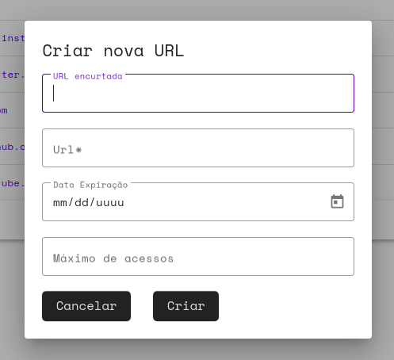
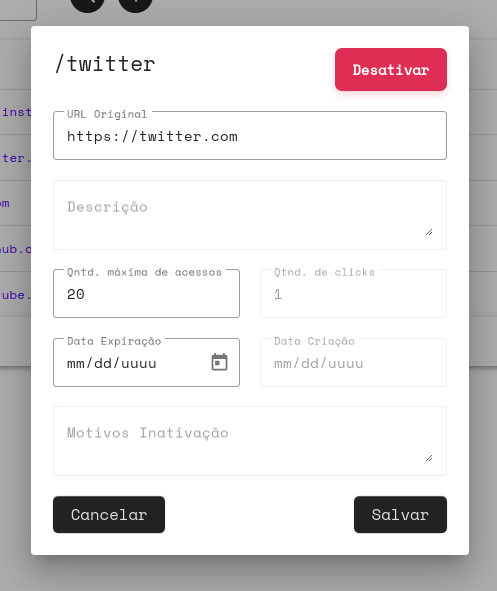

<!-- Improved compatibility of back to top link: See: https://github.com/othneildrew/Best-README-Template/pull/73 -->
<a name="readme-top"></a>
<!--
*** Thanks for checking out the Best-README-Template. If you have a suggestion
*** that would make this better, please fork the repo and create a pull request
*** or simply open an issue with the tag "enhancement".
*** Don't forget to give the project a star!
*** Thanks again! Now go create something AMAZING! :D
-->


<!-- PROJECT SHIELDS -->
<!--
*** I'm using markdown "reference style" links for readability.
*** Reference links are enclosed in brackets [ ] instead of parentheses ( ).
*** See the bottom of this document for the declaration of the reference variables
*** for contributors-url, forks-url, etc. This is an optional, concise syntax you may use.
*** https://www.markdownguide.org/basic-syntax/#reference-style-links
-->
[![Contributors][contributors-shield]][contributors-url]
[![Forks][forks-shield]][forks-url]
[![Stargazers][stars-shield]][stars-url]
[![Issues][issues-shield]][issues-url]
[![MIT License][license-shield]][license-url]
[![LinkedIn][linkedin-shield]][linkedin-url]


<!-- PROJECT LOGO -->
<br />
<div align="center">
<h3 align="center">URL Shortener</h3>

  <p align="center">
    <br />
    <a href="https://github.com/gabriGutiz/url-shortener"><strong>Explore the docs »</strong></a>
    <br />
    <br />
    <a href="https://github.com/gabriGutiz/url-shortener/issues">Report Bug</a>
    ·
    <a href="https://github.com/gabriGutiz/url-shortener/issues">Request Feature</a>
  </p>
</div>


<!-- TABLE OF CONTENTS -->
<details>
  <summary>Table of Contents</summary>
  <ol>
    <li>
      <a href="#about-the-project">About The Project</a>
      <ul>
        <li><a href="#built-with">Built With</a></li>
      </ul>
    </li>
    <li>
      <a href="#getting-started">Getting Started</a>
      <ul>
        <li><a href="#prerequisites">Prerequisites</a></li>
        <li><a href="#installation">Installation</a></li>
        <li><a href="#set-up">Set up</a></li>
        <li><a href="#how-to-run">How to run</a></li>
      </ul>
    </li>
    <li><a href="#usage">Usage</a></li>
    <li><a href="#roadmap">Roadmap</a></li>
    <li><a href="#contributing">Contributing</a></li>
    <li><a href="#license">License</a></li>
    <li><a href="#contact">Contact</a></li>
    <li><a href="#acknowledgments">Acknowledgments</a></li>
  </ol>
</details>


<!-- ABOUT THE PROJECT -->
## About The Project

![Product Name Screen Shot][product-screenshot]
This project is a URL shotener made with `nodejs` for the backend and `Angular`.
<p align="right">(<a href="#readme-top">back to top</a>)</p>


### Built With

* [![Angular][Angular.io]][Angular-url]
* [![Node][Node.org]][Node-url]
* [![MongoDB][Mongodb.com]][Mongo-url]

<p align="right">(<a href="#readme-top">back to top</a>)</p>


<!-- GETTING STARTED -->
## Getting Started

Follow the prerequisites, installation, set up and how to run guide to run the application locally.

### Prerequisites

Install `npm` and `angular`
* npm
  ```sh
  npm install npm@latest -g
  ```
* Angular
  ```sh
  npm install @angular/cli -g
  ```

### Installation

1. Clone the repo
   ```sh
   git clone https://github.com/gabriGutiz/url-shortener.git
   ```
2. Install NPM packages, run the following command on [`api/`][api-folder] and [`site/`][site-folder] folders
   ```sh
   npm install
   ```

### Set up

1. Add Mongodb URI and change the port if desired on the file [`api/environments/.dev.env`][api-config-file]
   ```
   MONGO_CONN=YOUR_URI
   PORT=8000
   ```
2. Remove temporally the authorization of users route at the api - comment the auth line on the [users route file][api-auth-file]
   ```js
   router.use(auth);
   ```
3. Run the api project following the first step of <a href="#how-to-run">How to run</a>

4. Create a api user for your application using curl on the terminal
   ```sh
   curl -H "Accept: application/json" \
        -H "Content-Type: application/json" \
        -d '{"user":"{YOUR_USER}", "senha":"{YOUR_PASSW}"}' \
        -X POST \
        http://localhost:{PORT}/api/users
   ```

5. Change api url, user and password on the file [`site/src/environment.ts`][site-config-file]
   ```ts
   export const environment = {
     production: false,
     api: 'http://localhost:{PORT}',
     user: '{YOUR_USER}',
     senha: '{YOUR_PASSWORD}'
   };
   ```

### How to run

1. Go to [`api/`][api-folder] folder to run the api project
   ```sh
   npm start
   ```

2. Go to [`site/`][site-folder] folder to run the site project
   ```sh
   ng serve
   ```

<p align="right">(<a href="#readme-top">back to top</a>)</p>


<!-- USAGE EXAMPLES -->
## Usage

This application is used to create urls that redirect to the desired with a admin site. The user can control the max of access and expiration date for the created url as shown at:

<p align="center">
  
</p>

The user can inactivate the url anytime, change the expiration date and max of access at any time on the control page:

<p align="center">
  
</p>

<p align="right">(<a href="#readme-top">back to top</a>)</p>

<!-- ROADMAP -->
## Roadmap

See the [open issues](https://github.com/gabriGutiz/url-shortener/issues) for a full list of proposed features (and known issues).

<p align="right">(<a href="#readme-top">back to top</a>)</p>


<!-- CONTRIBUTING -->
## Contributing

Contributions are what make the open source community such an amazing place to learn, inspire, and create. Any contributions you make are **greatly appreciated**.

If you have a suggestion that would make this better, please fork the repo and create a pull request. You can also simply open an issue with the tag "enhancement".
Don't forget to give the project a star! Thanks again!

1. Fork the Project
2. Create your Feature Branch (`git checkout -b feature/AmazingFeature`)
3. Commit your Changes (`git commit -m 'Add some AmazingFeature'`)
4. Push to the Branch (`git push origin feature/AmazingFeature`)
5. Open a Pull Request

<p align="right">(<a href="#readme-top">back to top</a>)</p>


<!-- LICENSE -->
## License

Distributed under the MIT License. See `LICENSE.txt` for more information.

<p align="right">(<a href="#readme-top">back to top</a>)</p>


<!-- CONTACT -->
## Contact

Gabriel Gutierrez - [in/gchinelli](https://www.linkedin.com/in/gchinelli/) - gabri.gutiz@outlook.com

Project Link: [https://github.com/gabriGutiz/url-shortener](https://github.com/gabriGutiz/url-shortener)

<p align="right">(<a href="#readme-top">back to top</a>)</p>


<!-- ACKNOWLEDGMENTS -->
## Acknowledgments

* [README template](https://github.com/othneildrew/Best-README-Template/)

<p align="right">(<a href="#readme-top">back to top</a>)</p>


<!-- MARKDOWN LINKS & IMAGES -->
<!-- https://www.markdownguide.org/basic-syntax/#reference-style-links -->
[contributors-shield]: https://img.shields.io/github/contributors/gabriGutiz/url-shortener.svg?style=for-the-badge
[contributors-url]: https://github.com/gabriGutiz/url-shortener/graphs/contributors
[forks-shield]: https://img.shields.io/github/forks/gabriGutiz/url-shortener.svg?style=for-the-badge
[forks-url]: https://github.com/gabriGutiz/url-shortener/network/members
[stars-shield]: https://img.shields.io/github/stars/gabriGutiz/url-shortener.svg?style=for-the-badge
[stars-url]: https://github.com/gabriGutiz/url-shortener/stargazers
[issues-shield]: https://img.shields.io/github/issues/gabriGutiz/url-shortener.svg?style=for-the-badge
[issues-url]: https://github.com/gabriGutiz/url-shortener/issues
[license-shield]: https://img.shields.io/github/license/gabriGutiz/url-shortener.svg?style=for-the-badge
[license-url]: https://github.com/gabriGutiz/url-shortener/blob/master/LICENSE.txt
[linkedin-shield]: https://img.shields.io/badge/-LinkedIn-black.svg?style=for-the-badge&logo=linkedin&colorB=555
[linkedin-url]: https://linkedin.com/in/gchinelli
[Angular.io]: https://img.shields.io/badge/Angular-DD0031?style=for-the-badge&logo=angular&logoColor=white
[Angular-url]: https://angular.io/
[Node.org]: https://img.shields.io/badge/Node.js-43853D?style=for-the-badge&logo=node.js&logoColor=white
[Node-url]: https://nodejs.org/
[Mongodb.com]: https://img.shields.io/badge/MongoDB-4EA94B?style=for-the-badge&logo=mongodb&logoColor=white
[Mongo-url]: https://mongodb.com/

[product-screenshot]: docs/screenshot.png
[create-screenshot]: docs/screenshot-create.png
[control-screenshot]: docs/screenshot-control.png
[api-folder]: https://github.com/gabriGutiz/url-shortener/tree/master/api
[site-folder]: https://github.com/gabriGutiz/url-shortener/tree/master/api
[api-config-file]: https://github.com/gabriGutiz/url-shortener/blob/master/api/environments/.dev.env
[site-config-file]: https://github.com/gabriGutiz/url-shortener/blob/master/site/src/environments/environment.ts
[api-auth-file]: https://github.com/gabriGutiz/url-shortener/blob/master/api/src/routes/users.route.js